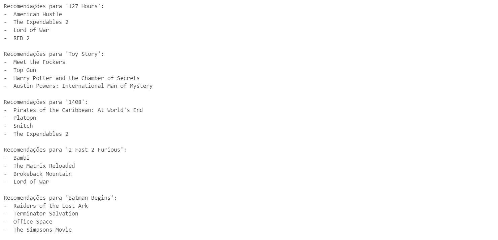

# Ciência de Dados - Projeto Final 6

## Projeto
**Modelo de recomendação** de filmes e séries em uma plataforma de streaming.

## Objetivo
O objetivo do projeto é, a partir dos dados fornecidos pela equipe de Dados, construir um **modelo de recomendação** para sugerir filmes para os assinantes em uma plataforma de streaming.  

A intenção é que o modelo identifique o gosto de filmes dos assinantes e possa sugerir os melhores filmes para que possa reter os assinantes por mais tempo na plataforma, otimizando assim o faturamento da empresa com menor índice de churn e trazendo mais assinantes para plataforma.

## Descrição
Nesse projeto de Ciência de Dados, foi criado um modelo de recomendação usando KNN, a partir de dados fornecidos pela equipe de Dados, para sugerir filmes para os assinantes em uma plataforma de streaming.

Esse projeto visa identificar o gosto de filmes dos assinantes e enviar as melhores sugestões para que possa reter os assinantes por mais tempo na plataforma, otimizando assim o faturamento da empresa com menor índice de churn e trazendo mais assinantes para plataforma.                                                                                               |

## Referências
- **Link do Kaggle:** https://www.kaggle.com/code/ibtesama/getting-started-with-a-movie-recommendation-system

## Bibliotecas
- **Matplotlib:** https://matplotlib.org/
- **NumPy:** https://pandas.pydata.org/docs/index.html
- **Pandas:** https://pandas.pydata.org/docs/index.html
- **Scikit-Learn:** https://seaborn.pydata.org/
- **Seaborn:** https://seaborn.pydata.org/

## Estrutura do Projeto
- **.venv/:** Pasta destinada a armazenar o ambiente virtual do projeto se necessário
- **data/:** Pasta destinada a armazenar as versões dos datasets: raw, processed, lean, transformed, entre outros
- **deploys/:** Pasta destinada a armazenar os deploys do projeto, em formatos jupyter notebook, python, executável e streamlit
- **dictionaries/:** Pasta destinada a armazenar os dicionários do projeto: charts, data, datasets, evaluation metrics, feature engineering, models, pipeline e stats
- **docs/:** Pasta destinada a armazenar os arquivos e documentos referentes ao projeto
- **functions/:** Pasta destinada a armazenar arquivos com as funções do projeto: charts, libraries e stats
- **images/:** Pasta destinada a armazenar imagens do projeto: illustrations e outputs
- **models/:** Pasta destinada a armazenar os modelos criados durante o projeto
- **notebooks/:** Pasta destinada a armazenar os notebooks de cada etapa do projeto de ciência de dados
- **params/:** Pasta destinada a armazenar as constantes e variáveis globais do projeto
- **presentations/:** Pasta destinada a armazenar as apresentações do projeto, em PowerPoint e PDF
- **references/:** Pasta destinada a armazenar arquivos com informações do projeto, como markdown tables e cronograma
- **reports/:** Pasta destinada a armazenar relatórios criados durante o projeto
- `.env`: Arquivo para armazenar as variáveis de ambiente sensíveis do projeto, como usuários, senhas, tokens e chaves de API
- `.gitattributes`: Arquivo para configurar o repositório e omitir arquivos sem utilidades da versão final do projeto
- `.gitignore`: Arquivo para ignorar determinados arquivos ao subir o projeto para o Github
- `LICENSE`: Arquivo com a licença do projeto
- `README.md`: Arquivo para resumir e apresentar o projeto
- `requirements.txt`: Arquivo para listar as dependências/bibliotecas necessárias no projeto
- `to_do.txt`: Arquivo para anotar as tarefas pendentes do projeto

## Recomendações
